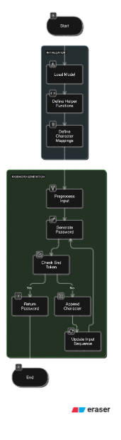
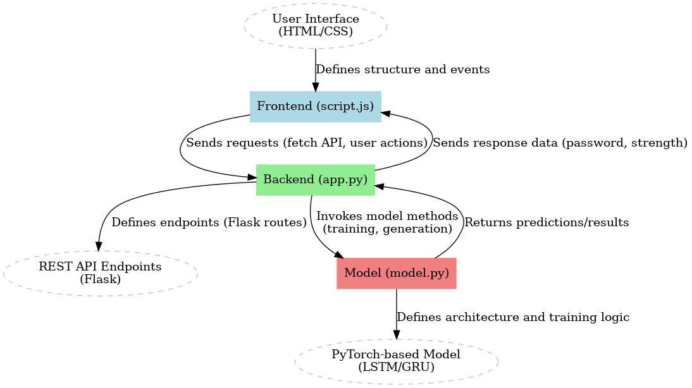

# Hash Cipher

## Link
- [Website Hosted by GitHub Pages](https://flkram.github.io/Hash-Cipher/).

## Overview
Hash Cipher allows users to hash files or text using various cryptographic algorithms, including **SHA256**, **SHA1**, **MD5**, and **CRC32**. The application also integrates machine learning algorithms to **analyze** password security, **generate** passwords using the model, and **train** the AI model based on a list of password data. The backend uses Flask (Python) and C++ for hashing, while the frontend provides an interactive experience for users to input data, view results, and interact with password strength analysis. The AI model uses PyTorch for the LSTM model, GRUs, and deep learning algorithms. 

## Technologies Used

- **C++**: Used for implementing the core cryptographic hashing algorithms (SHA256, SHA1, MD5, CRC32). The C++ code is responsible for securely hashing text or files and providing the hashed output.
- **Flask and Python**: Used for backend. Handles user requests such as sending text or files for hashing, password strength analysis, and model training. Reads c++ code by converting it into a .so file
- **PyTorch**: Used to implement machine learning algorithms for password strength analysis and generation. The PyTorch model evaluates password strength based on historical password data and adjusts the analysis over time with additional training data. A password similar to the previously used password is generated when prompted.
- **Pandas**: Utilized for managing and processing the training data (in JSON or txt format). It helps in efficiently handling and manipulating password datasets used to train the machine learning model.
- **JavaScript**: The frontend is built using standard web technologies like HTML, CSS, and JavaScript to provide an intuitive and responsive interface for users to interact with the application.


## Getting Started and Running the Project

### Frontend

You can access it through the link provided above. You can also access index.html locally after cloning this project.

### Backend

The backend is powered by Flask. To run the backend, follow these steps:

1. **Clone the repository**:
   ```bash
   git clone https://github.com/flkram/Hash-Cipher.git
   ```
2. **Go to Python Source Folder**:
   ```bash
   cd Hash-Cipher/src
   ```
3. **Set up the Python Virtual environment** (optional but recommended):

    MacOS or Linux:
     ```bash
     python3 -m venv venv
     source venv/bin/activate  # On Windows, use venv\Scripts\activate
     ```

    Windows:
     ```bash
     python3 -m venv venv
     .\venv\Scripts\Activate.ps1
     ```

4. **Install Python Dependencies**:
     ```bash
     pip install -r requirements.txt
     ```
5. **Run the Flask server**:
   ```bash
   flask run
   ```
   or
   ```bash
   python app.py
   ```    


## Diagrams

  ### PyTorch Model Flowchart:
   
  

  ### Entity Relationship Diagram:

  

  
## Training data Input Examples (json format):
- {}
- {
  "pass1": "password",
  "pass2": "password",
  "pass3": "password",
  "pass4": "password",
  "pass5": "password",
  }
- {
  "key1": "x7L!9t@0w",
  "key2": "F$2v*3Gqz",
  "key3": "R@8Km#6vW",
  "key4": "N$3Lp!4xT",
  "key5": "P%7Qr*1Ys",
  "key6": "C#6Vz@3Tp",
  "key7": "M!1Nk$2Fr",
  "key8": "D%5Qs*8Vy",
  "key9": "B!3Wx@7L",
  "key10": "G#2Tp$5m"
  }
-  {
  "pass1": "password",
  "pass2": "password",
  "pass3": "password",
  "pass4": "password",
  "pass5": "password",
  "pass6": "password",
  "pass7": "password",
  "pass8": "password",
  "pass9": "password",
  "pass10": "password",
  "pass11": "password",
  "pass12": "password",
  "pass13": "password",
  "pass14": "password",
  "pass15": "password",
  "pass16": "password",
  "pass17": "password",
  "pass18": "password",
  "pass19": "password",
  "pass20": "password",
  "pass21": "password",
  "pass22": "password",
  "pass23": "password",
  "pass24": "password",
  "pass25": "password",
  "pass26": "password",
  "pass27": "password",
  "pass28": "password",
  "pass29": "password",
  "pass30": "password",
  "pass31": "password",
  "pass32": "password",
  "pass33": "password",
  "pass34": "password",
  "pass35": "password",
  "pass36": "password",
  "pass37": "password",
  "pass38": "password",
  "pass39": "password",
  "pass40": "password",
  "pass41": "password",
  "pass42": "password",
  "pass43": "password",
  "pass44": "password",
  "pass45": "password",
  "pass46": "password",
  "pass47": "password",
  "pass48": "password",
  "pass49": "password",
  "pass50": "password"
}
